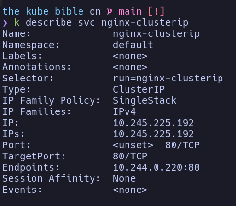
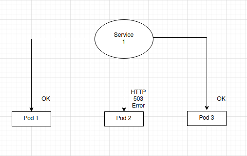

# Services

[demo 1](./demo_1_new-nginx-pod.yaml)

you can get ip of Pod by using

`kubectl get po -o wide`

the output

the IP show is unique. It only exist in kube cluster!

## Understanding Pod IP assignment is dynamic
When you delete and recreate, and recheck IP `kubectl get po -o wide`
The IP is not the same.

> Never hardcode a pod's IP address in your application code.

## Understanding how services route traffic to Pods

> Kube service are not Docker container or Pod.

kube service are resource running within your Kube cluster,
and they are used to create appropriate `IPTABLES` to ensure
the traffic is properly redirected to backend Pods

## Understanding how to call a service in Kube

When create a Service in kube, it will be attach two very important things,
* An IP address that will be unique and specific to it.
* An automatically generated DNS name that won't change and is static.

> Let's try to create Pod and Service
`kubectl run nginx --image nginx:latest --expose --port 80`

List all service `kubectl get svc`

## Using the dnsutils Docker image to debug your services

> Run the follow command to launch the `dnsutils` Pods on our cluster:

`kubectl apply -f https://k8s.io/examples/admin/dns/dnsutils.yaml`

then:

> Keep in mind that the nginx.default.svc.cluster.local DNS name is not a public
can be only accessible from within the cluster.

## Understanding how DNS names are generated for services.

> Kube services-to-pod communication relies entirely on labels on the Pod

The workflow goes like this:
* Create some Pods and set some labels.
* Create a Service and Configure its selector to match the Pod's label.
* Service start and looks for Pods that match its selector.
* Call the service throught its DNS or its IP (DNS way easier).
* The service forwards the traffic to one of the Pods that matches its label.

## Type of Service on kube

> The goal remains the same: to expose your Pods using a single static interface.

> A service cannot be multiple type at once. But you can expose the same Pods by two
service.

* NodePort: this one bind port from ephemeral port range of the host machine.
By calling the port of the host machine, it'll reach the associated Kube Pod.

* ClusterIP: this service be used for private communication between Pods within Kube cluster.

* LoadBalancer: 

### The NodePort service

> NodePort is a kube service type designed to make Pods reachable from a port available on the host machine.

Let's demo on it.

* First create the whoami pod with this command
  * `kubectl run whoami --image=containous/whoami --port 80 --labels="app=whoami"`
* Then `kubectl get po --show-labels` to see the pod labels
* Create NodePort service [nodeport](./nodeport-whoami.yaml)
* Check pods label `kubectl get po -l "app=whoami"`
* Now NodePort service and the Pods it exposes by calling the following address:
<WORKER_NODE_IP_ADDRESS>:30001
  * it can be a port from the 30000 - 32767 range.

> For convenience and to reduce complexity, the NodePort service port and target port
are often defined to the same value.

#### Describe NodePort service
> It's very easy just `kubectl describe svc <NODEPORT_NAME>`

#### Delet NodePort
> You should careful when deleting service: it won't delete the Pods behind it.

`kubectl delete svc <NODEPORT_NAME>`

> Don't create NodePort for testing, and don't try to use `kubectl port-forward` for production!

### The ClusterIP Service

ClusterIP service are mean to expose Pods to other Pods inside the Kube cluster
this service grants a static IP within the cluster!, keep in mind the ClusterIP are not
accesible from outside.

#### Creating ClusterIP services using the imperative way

`kubectl run nginx-clusterip --image nginx --expose --port 80`

then `kubectl describe svc nginx-clusterip` the output is:

we can check which pod link to tis cluster by

`kubectl get po --show-labels`

and look at `LABELS` match with `Selector`

Let's use `dnsutils` container to do something.

`kubectl exec -it dnsutils -- curl nginx-clusterip.default.svc.cluster.local`

#### Creating ClusterIP services using the declarative way

[demo clusterip](./clusterip-svc.yaml)

#### Deleting ClusterIP services

`kubectl delete svc <SERVICE_NAME>`

### The LoadBalancer service

> It's relies on the cloud platform where the Kube cluster is provisioned

Indeed, Services obey a simple rule:
  they serve traffic to every Pod that matches their label selector.

### Implementing ReadinessProbe

`ReadinessProbe` can be of three different types, as outlined here:
* Command: it's should be complete with exit code 0
* HTTP: it's should complete with a response code >= 200 and < 400, which indicates the Pod is ready.
* TCP: 

[demo readiness](./nginx-pod-with-readiness.yaml)

### LivenessProbe

> If you already used some cloud providers before, you might already have heard about something called health checks. So, in other words `LivenessProbe` is basically a health check.

imagine a situation where you have a service forwarding traffic to three Pods
and one of them is broken

Services cannot detect that on their own, and they will just continue to serve traffic to the three Pods, include a broken one.

you want to avoid such situation, and to do the, you need a way to detect situation where Pods are broken.

`LivenessProbe` is the solution to this problem

> LivenessProbe cannot repair a Pod, it can only detect that a Pod is not healthy and command its termination.

[demo liveness-probe](./nginx-pod-with-liveness.yaml)

an HTTP health check to success, it must answer an HTTP >= 200 and < 400.
404 being out of range, the answer Pod won't be healthy

Also use a command to check if a Pod is healthy or not

[demo liveness-probe-cmd](./nginx-pod-with-liveness-command.yaml)

can use TCP as well

[demo liveness-probe-tcp](./nginx-pod-with-liveness-tcp.yaml)

Having TCP as a liveness probe is nice especially if you want to keep track of an application that is base on HTTP 

