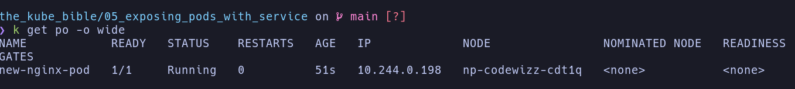
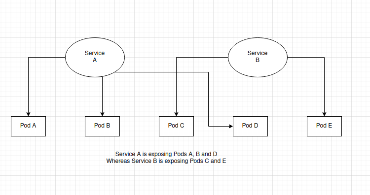
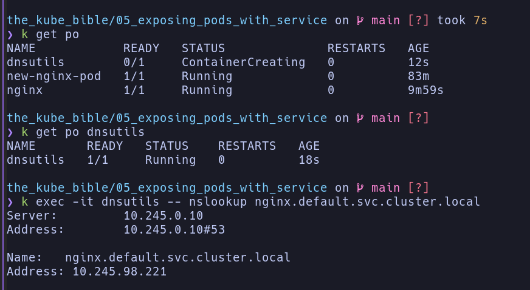
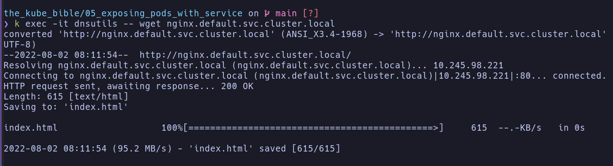
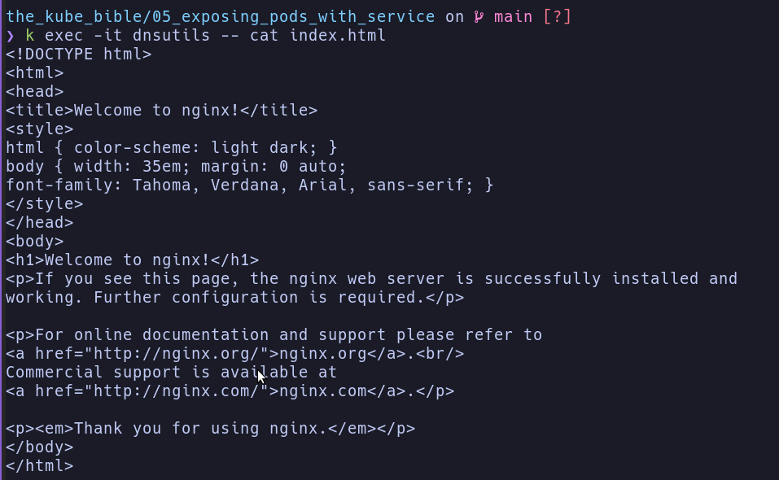
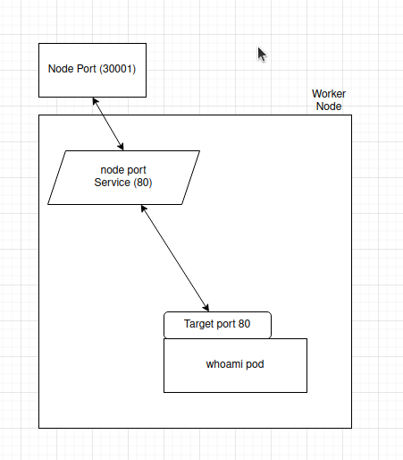

# Services

[demo 1](./demo_1_new-nginx-pod.yaml)

you can get ip of Pod by using

`kubectl get po -o wide`

the output

the IP show is unique. It only exist in kube cluster!

## Understanding Pod IP assignment is dynamic
When you delete and recreate, and recheck IP `kubectl get po -o wide`
The IP is not the same.

> Never hardcode a pod's IP address in your application code.

## Understanding how services route traffic to Pods

> Kube service are not Docker container or Pod.

kube service are resource running within your Kube cluster,
and they are used to create appropriate `IPTABLES` to ensure
the traffic is properly redirected to backend Pods

## Understanding how to call a service in Kube

When create a Service in kube, it will be attach two very important things,
* An IP address that will be unique and specific to it.
* An automatically generated DNS name that won't change and is static.

> Let's try to create Pod and Service
`kubectl run nginx --image nginx:latest --expose --port 80`

List all service `kubectl get svc`

## Using the dnsutils Docker image to debug your services

> Run the follow command to launch the `dnsutils` Pods on our cluster:

`kubectl apply -f https://k8s.io/examples/admin/dns/dnsutils.yaml`

then:

> Keep in mind that the nginx.default.svc.cluster.local DNS name is not a public
can be only accessible from within the cluster.

## Understanding how DNS names are generated for services.

> Kube services-to-pod communication relies entirely on labels on the Pod

The workflow goes like this:
* Create some Pods and set some labels.
* Create a Service and Configure its selector to match the Pod's label.
* Service start and looks for Pods that match its selector.
* Call the service throught its DNS or its IP (DNS way easier).
* The service forwards the traffic to one of the Pods that matches its label.

## Type of Service on kube

> The goal remains the same: to expose your Pods using a single static interface.

> A service cannot be multiple type at once. But you can expose the same Pods by two
service.

* NodePort: this one bind port from ephemeral port range of the host machine.
By calling the port of the host machine, it'll reach the associated Kube Pod.

* ClusterIP: this service be used for private communication between Pods within Kube cluster.

* LoadBalancer: 

### The NodePort service

> NodePort is a kube service type designed to make Pods reachable from a port available on the host machine.

Let's demo on it.

* First create the whoami pod with this command
  * `kubectl run whoami --image=containous/whoami --port 80 --labels="app=whoami"`
* Then `kubectl get po --show-labels` to see the pod labels
* Create NodePort service [nodeport](./nodeport-whoami.yaml)
* Check pods label `kubectl get po -l "app=whoami"`
* Now NodePort service and the Pods it exposes by calling the following address:
<WORKER_NODE_IP_ADDRESS>:30001
  * it can be a port from the 30000 - 32767 range.

> For convenience and to reduce complexity, the NodePort service port and target port
are often defined to the same value.

