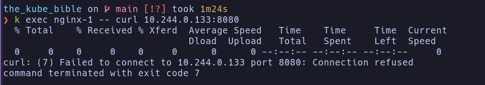

# NetworkPolicy

> it's brings three benefits, as follows:

You can build egress/ingress rule base on:
* Classless Inter Domain Routing (CIDR) block.
* Pods labels and selector
* Namespace

## Let's try demo

> Configuring NetworkPolicy with labels and selectors

* First create two pods for demonstrate with the `NetworkPolicy`, as follows:
* `kubectl run nginx-1 --image nginx --labels 'app=nginx-1'`
* `kubectl run nginx-2 --image nginx --labels 'app=nginx-2'`
* Then let's check ip of Pods `kubectl get po -o wide`
* After that we can use ip of nginx-1 to curl nginx-2 by ip.
  * `kubectl exec nginx-1 -- curl <POD_IP>`
  * `kubectl exec nginx-1 -- curl 10.244.0.133`
* Create NetworkPolicy via declarative [networkpolicy](./nginx-2-networkpolicy.yaml)
* apply it `kubectl create -f nginx-2-networkpolicy.yaml`
  * check NetworkPolicy `kubectl get networkpolicy`

> Keep in mind that if no NetworkPolicy is set on the Pod, the default behavior applies--everything is allowed for the Pod

* Now let's update port 80 to 8080.
* then `curl` from nginx-1 to nginx-2 on port 80.
  * it's get time out
* then `curl` from nginx-1 to nginx-2 on port 8080.

As you can see, no timeout this tiem. The traffic reaches the `nginx-2`
Pod, but since nothing is listening on port `8080`, then we have a 
`Connection refused`

